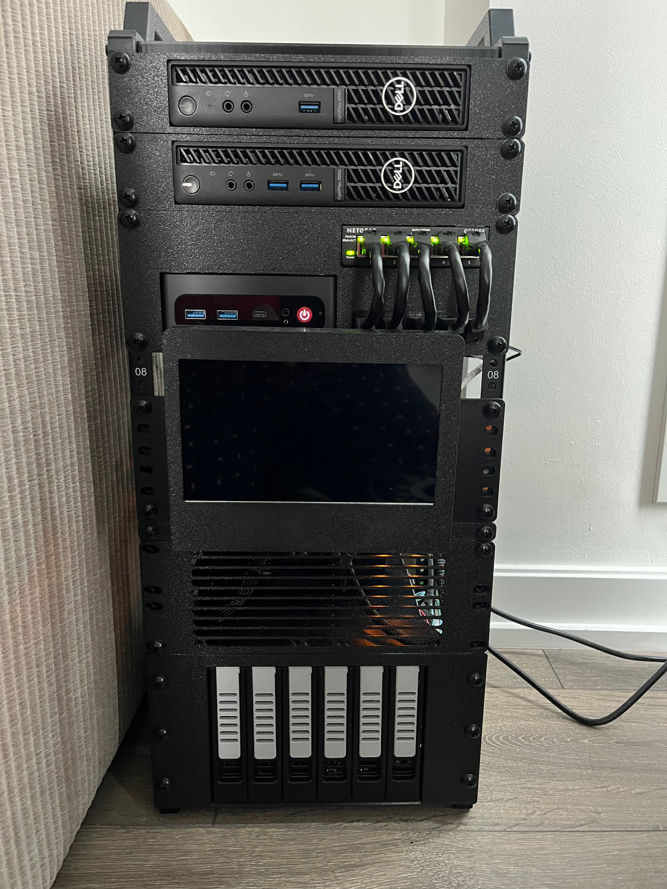
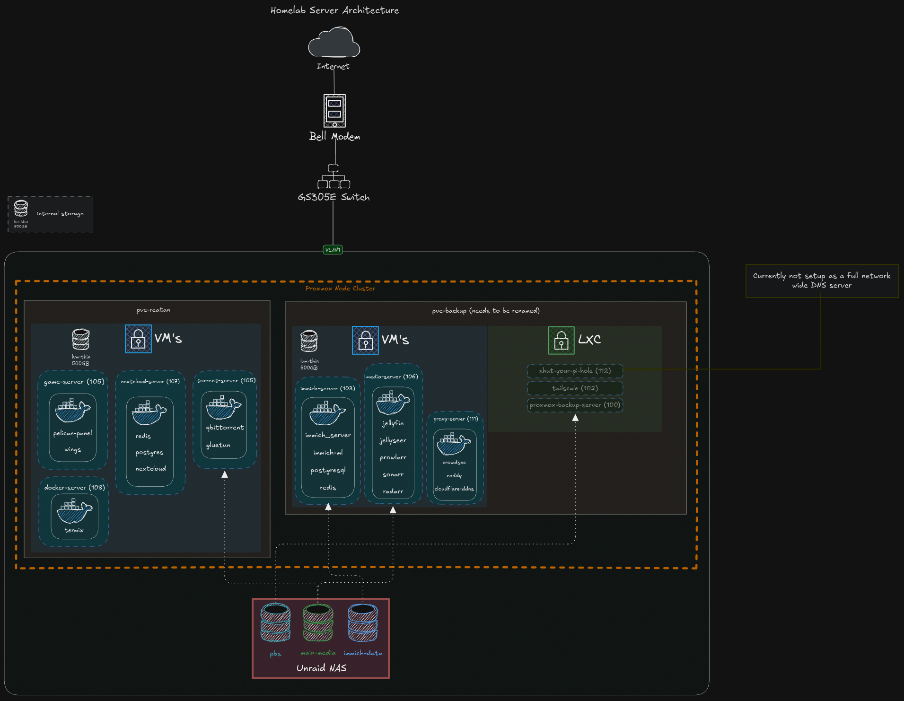

# 12U Rack

## Project Overview
This is a post to showcase my ongoing project and search for a 'PERFECT' homelab. I'll go through its current state, how I got here, the problems I ran into
along the way, how I solved them, and plans for the future.

## General Architecture

_This diagram is a general overview of my entire homelab, and how everything connects together. I'm not entirely sure if I should just separate these into a component diagram and network diagram, this is what made sense to me at the time._

The lab consists of multiple physical computers running Proxmox, setup in a cluster (mainly for the general overview of all my nodes), I've seperated all services to run on seperate VM's for better seperation of concerns:

## Physical Hardware
| Component | Model | Purpose | RAM | CPU |
|-----------|-------|---------|-----|-----|
| Mini PC 1  | Dell Optiplex 3080 | Proxmox node | 8GB DDR4 | i3-10105T |
| Mini PC 2 | Dell Optiplex 3090 | Proxmox node | 16GB DDR4 | i5-10500T |
| Mini PC 3 | Reatan S6 | Main Proxmox host | 24GB DDR4 | i5-12450H |
| NAS PC | Self Built | Used for serving files, network attached storage | 8GB DDR4 | 5600GT |
| Switch | GS305E | Connects all my PC's into one single network | N/A | N/A |

## Development Journey & Challenges
Throughout my journey building my homelab, like many others, I ran into many different sets of problems. Regardless of how tech savvy you are, we all encounter similar issues, and problems we all need to face. These are some of the problems I faced, different solutions I came across, and why I chose the solution I did.

- **To Expose or Not to Expose**
  One of the biggest early decisions was whether services should be reachable from the public internet at all. It sounded simple at first, honestly I said this to myself many times, “I’ll just use HTTPS and a reverse proxy”—but it quickly becomes a question of security tolerance and acceptable blast radius (I will include a glossary for all tech jargon).

    - **Figuring out my security tolerance for internet exposure**: Honestly this probably deserves its own seperate page on the dangers of exposing crucial services to the internet. Main risk, is that anyone can try to access your services, you can get hacked in different ways such as credential stuffing/brute force attacks, potential bugs in software can pose a security risk, etc.

    >**Note:** Important thing I learned down the line, for those that are in the same boat that I was in, reverse proxies and HTTPS should not be the only layer of "protection" used when exposing services to the big ol internet. It only helps protect your data thats in transit! 

  **My Options:**
    - **Private-only access**: Meaning I don't expose any services directly to the internet. The drawback to this, is that I would need to make sure to setup a VPN such as tailscale to be able to access my services, along with anyone else I share my services with. This was too big of a hassle, especially for my friends or family that are not so tech savvy.
    - **Public access with minimal controls**: This is pretty much like raw-dogging the internet, no protection, the bare minimum required for anyone to access your services. Obviously, this was not something I wanted.
    - **Using 3rd Party Proxy**: This was obviously the simplest and most straightforward solution. Just use a third party provider, like Cloudflare to proxy your request's for you. This came with 2 drawbacks, one being that I give control to another large company over my data (whatever traffic flows between the internet and cloudflare to my services), if cloudflare goes down, I won't be able to access my services, and yes this is possible!! But wait, what if you're homelab proxy goes out, its less reliable, yes you're right, but I still have full control over what happens next, I know exactly when it will be fixed, what the problem was. Im unsure with other 3rd party providers, but Cloudflare has a file size limit that they will proxy, this limit being 100MB for their free tier. This is a great solution for most people, and it's probably something I would use if I was a bigger fish in the ocean.
    - **Reverse proxy, with strong front-door controls**: What I mean by this, is using a reverse proxy of your choice, I chose Nginx Proxy Manager at first, but now use Caddy. Then I paired Caddy with Crowdsec, which is an intrusion detection program that reads traffic logs. It analyzes these logs for malicious patterns, then bans clients from accessing services. This is the solution I ended up going with since I was able to selfhost every part of it. It's nothing enterprise grade, and I'm sure theres potential vulnerabilities, but it makes it much harder to hack into using most common exploits and methods.

    >**Note:** I'm also very proactive and follow general best practices to keep my services safe, and secure.

## Technologies Used

TODO

## Design Philosophy

The homelab follows several key principles:

## Development Journey

TODO

## Lessons Learned

TODO

## Current Services

TODO

## Future Roadmap
TODO
